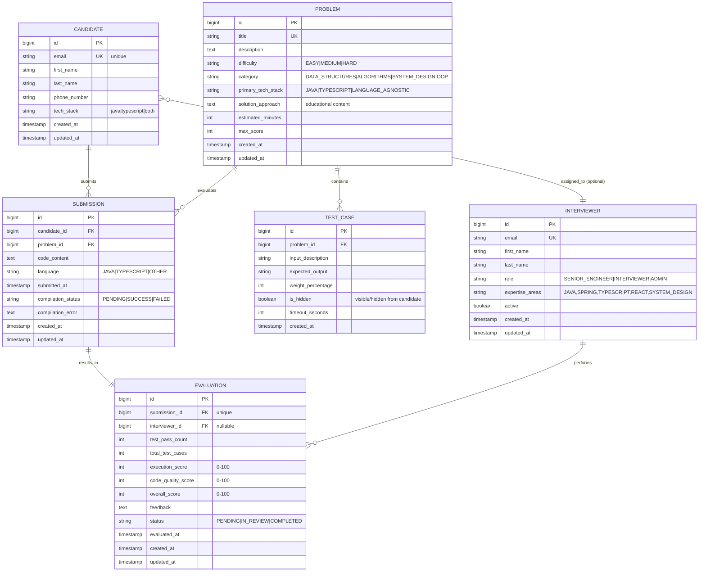

# Tech Interview System - Database Schema Design

**Version**: 1.0
**Date**: 2025-11-14
**Status**: Implemented
**Wave**: Wave 1: Database Schema Design

---

## Executive Summary

This document defines the complete database schema for the Tech Interview System - a realistic interview evaluation platform for Java/Spring and TypeScript/React candidates. The schema supports:

- Candidate profile management
- Interview problem repositories with test cases
- Code submission evaluation and scoring
- Interviewer assignment and feedback tracking

**Key Design Principles**:
- Normalization for data integrity (3NF)
- Referential integrity with cascading deletes for related records
- Indexed foreign keys and frequent query patterns
- Audit trail support (timestamps for all entities)
- Scalable for 10K+ candidates and 1K+ problems

---

## Entity-Relationship Diagram



---

## Detailed Table Specifications

### 1. CANDIDATE

**Purpose**: Store candidate profile information

| Column | Type | Constraints | Description |
|--------|------|-----------|-------------|
| `id` | BIGINT | PK, AUTO_INCREMENT | Unique identifier |
| `email` | VARCHAR(255) | UNIQUE, NOT NULL | Email address (unique identifier for login) |
| `first_name` | VARCHAR(100) | NOT NULL | Candidate first name |
| `last_name` | VARCHAR(100) | NOT NULL | Candidate last name |
| `phone_number` | VARCHAR(20) | | Phone number (optional) |
| `tech_stack` | VARCHAR(20) | NOT NULL, DEFAULT 'JAVA' | Primary tech stack (JAVA, TYPESCRIPT, BOTH) |
| `created_at` | TIMESTAMP | NOT NULL, DEFAULT CURRENT_TIMESTAMP | Record creation time |
| `updated_at` | TIMESTAMP | NOT NULL, DEFAULT CURRENT_TIMESTAMP | Last update time |

**Indexes**:
- PRIMARY KEY: `id`
- UNIQUE: `email` (for login/identification)
- INDEX: `tech_stack` (for filtering candidates by stack)

---

### 2. PROBLEM

**Purpose**: Define interview problems with metadata

| Column | Type | Constraints | Description |
|--------|------|-----------|-------------|
| `id` | BIGINT | PK, AUTO_INCREMENT | Unique identifier |
| `title` | VARCHAR(255) | UNIQUE, NOT NULL | Problem title (e.g., "Longest Substring Without Repeating Characters") |
| `description` | TEXT | NOT NULL | Detailed problem description and requirements |
| `difficulty` | VARCHAR(20) | NOT NULL, DEFAULT 'MEDIUM' | EASY, MEDIUM, HARD |
| `category` | VARCHAR(50) | NOT NULL | DATA_STRUCTURES, ALGORITHMS, SYSTEM_DESIGN, OOP |
| `primary_tech_stack` | VARCHAR(20) | NOT NULL | JAVA, TYPESCRIPT, LANGUAGE_AGNOSTIC |
| `solution_approach` | TEXT | | Explanation of optimal solution approach (for educational purposes) |
| `estimated_minutes` | INT | NOT NULL, DEFAULT 60 | Estimated time to solve (minutes) |
| `max_score` | INT | NOT NULL, DEFAULT 100 | Maximum score for perfect submission |
| `created_at` | TIMESTAMP | NOT NULL, DEFAULT CURRENT_TIMESTAMP | Record creation time |
| `updated_at` | TIMESTAMP | NOT NULL, DEFAULT CURRENT_TIMESTAMP | Last update time |

**Indexes**:
- PRIMARY KEY: `id`
- UNIQUE: `title`
- INDEX: `difficulty` (for filtering by difficulty)
- INDEX: `category` (for filtering by category)
- INDEX: `primary_tech_stack` (for filtering by tech stack)

---

### 3. TEST_CASE

**Purpose**: Define test cases for validating problem solutions

| Column | Type | Constraints | Description |
|--------|------|-----------|-------------|
| `id` | BIGINT | PK, AUTO_INCREMENT | Unique identifier |
| `problem_id` | BIGINT | FK (PROBLEM.id), NOT NULL | Reference to parent problem |
| `input_description` | VARCHAR(1000) | NOT NULL | Input data/parameters (JSON or plain text) |
| `expected_output` | VARCHAR(1000) | NOT NULL | Expected output/result |
| `weight_percentage` | INT | NOT NULL, DEFAULT 10 | Weight of this test in overall score (sum = 100) |
| `is_hidden` | BOOLEAN | NOT NULL, DEFAULT FALSE | Whether test is visible to candidate |
| `timeout_seconds` | INT | NOT NULL, DEFAULT 5 | Timeout for test execution |
| `created_at` | TIMESTAMP | NOT NULL, DEFAULT CURRENT_TIMESTAMP | Record creation time |

**Constraints**:
- Weight percentage validation: sum of weights per problem should = 100
- Timeout must be positive integer

**Indexes**:
- PRIMARY KEY: `id`
- FOREIGN KEY: `problem_id` → PROBLEM.id (ON DELETE CASCADE)
- INDEX: `problem_id` (for retrieving test cases by problem)

---

### 4. SUBMISSION

**Purpose**: Track code submissions from candidates

| Column | Type | Constraints | Description |
|--------|------|-----------|-------------|
| `id` | BIGINT | PK, AUTO_INCREMENT | Unique identifier |
| `candidate_id` | BIGINT | FK (CANDIDATE.id), NOT NULL | Reference to submitting candidate |
| `problem_id` | BIGINT | FK (PROBLEM.id), NOT NULL | Reference to problem being solved |
| `code_content` | TEXT | NOT NULL | Full source code submitted by candidate |
| `language` | VARCHAR(20) | NOT NULL | JAVA, TYPESCRIPT, OTHER |
| `submitted_at` | TIMESTAMP | NOT NULL | When code was submitted |
| `compilation_status` | VARCHAR(20) | NOT NULL, DEFAULT 'PENDING' | PENDING, SUCCESS, FAILED |
| `compilation_error` | TEXT | | Error message if compilation failed |
| `created_at` | TIMESTAMP | NOT NULL, DEFAULT CURRENT_TIMESTAMP | Record creation time |
| `updated_at` | TIMESTAMP | NOT NULL, DEFAULT CURRENT_TIMESTAMP | Last update time |

**Indexes**:
- PRIMARY KEY: `id`
- FOREIGN KEY: `candidate_id` → CANDIDATE.id (ON DELETE CASCADE)
- FOREIGN KEY: `problem_id` → PROBLEM.id (ON DELETE RESTRICT)
- COMPOSITE INDEX: `(candidate_id, problem_id)` (for candidate's submissions on a problem)
- INDEX: `submitted_at` (for time-range queries)
- INDEX: `compilation_status` (for filtering submissions)

---

### 5. EVALUATION

**Purpose**: Store evaluation results for submissions

| Column | Type | Constraints | Description |
|--------|------|-----------|-------------|
| `id` | BIGINT | PK, AUTO_INCREMENT | Unique identifier |
| `submission_id` | BIGINT | FK (SUBMISSION.id), UNIQUE, NOT NULL | Reference to evaluated submission (1:1 relationship) |
| `interviewer_id` | BIGINT | FK (INTERVIEWER.id), NULLABLE | Optional manual reviewer |
| `test_pass_count` | INT | NOT NULL, DEFAULT 0 | Number of tests passed (0 to total_test_cases) |
| `total_test_cases` | INT | NOT NULL | Total number of test cases for problem |
| `execution_score` | INT | NOT NULL, DEFAULT 0 | Score based on test results (0-100) |
| `code_quality_score` | INT | NOT NULL, DEFAULT 0 | Score based on code quality review (0-100) |
| `overall_score` | INT | NOT NULL, DEFAULT 0 | Final score (weighted average or manual override, 0-100) |
| `feedback` | TEXT | | Detailed feedback from automated + manual review |
| `status` | VARCHAR(20) | NOT NULL, DEFAULT 'PENDING' | PENDING, IN_REVIEW, COMPLETED |
| `evaluated_at` | TIMESTAMP | | When evaluation was completed |
| `created_at` | TIMESTAMP | NOT NULL, DEFAULT CURRENT_TIMESTAMP | Record creation time |
| `updated_at` | TIMESTAMP | NOT NULL, DEFAULT CURRENT_TIMESTAMP | Last update time |

**Indexes**:
- PRIMARY KEY: `id`
- FOREIGN KEY: `submission_id` → SUBMISSION.id (ON DELETE CASCADE)
- UNIQUE: `submission_id` (ensure 1:1 relationship)
- FOREIGN KEY: `interviewer_id` → INTERVIEWER.id (ON DELETE SET NULL)
- INDEX: `status` (for querying pending evaluations)
- INDEX: `evaluated_at` (for time-range queries)

---

### 6. INTERVIEWER

**Purpose**: Store interviewer profiles and assignments

| Column | Type | Constraints | Description |
|--------|------|-----------|-------------|
| `id` | BIGINT | PK, AUTO_INCREMENT | Unique identifier |
| `email` | VARCHAR(255) | UNIQUE, NOT NULL | Email address |
| `first_name` | VARCHAR(100) | NOT NULL | First name |
| `last_name` | VARCHAR(100) | NOT NULL | Last name |
| `role` | VARCHAR(30) | NOT NULL, DEFAULT 'INTERVIEWER' | SENIOR_ENGINEER, INTERVIEWER, ADMIN |
| `expertise_areas` | VARCHAR(500) | | Comma-separated list of expertise (JAVA, SPRING, TYPESCRIPT, REACT, SYSTEM_DESIGN, etc.) |
| `active` | BOOLEAN | NOT NULL, DEFAULT TRUE | Is interviewer currently active |
| `created_at` | TIMESTAMP | NOT NULL, DEFAULT CURRENT_TIMESTAMP | Record creation time |
| `updated_at` | TIMESTAMP | NOT NULL, DEFAULT CURRENT_TIMESTAMP | Last update time |

**Indexes**:
- PRIMARY KEY: `id`
- UNIQUE: `email`
- INDEX: `active` (for active interviewer queries)
- INDEX: `role` (for role-based filtering)

---

## Common Query Patterns

### 1. Get Candidate's Submissions with Evaluations
```sql
SELECT s.*, e.*
FROM submission s
LEFT JOIN evaluation e ON s.id = e.submission_id
WHERE s.candidate_id = ?
ORDER BY s.submitted_at DESC;
```
**Index needed**: `submission(candidate_id, submitted_at)`

### 2. Get All Test Cases for a Problem
```sql
SELECT * FROM test_case
WHERE problem_id = ?
ORDER BY id;
```
**Index needed**: `test_case(problem_id)`

### 3. Get Pending Evaluations
```sql
SELECT e.*, s.*, p.title
FROM evaluation e
JOIN submission s ON e.submission_id = s.id
JOIN problem p ON s.problem_id = p.id
WHERE e.status = 'PENDING'
ORDER BY e.created_at ASC;
```
**Index needed**: `evaluation(status, created_at)`

### 4. Get Problems by Difficulty and Tech Stack
```sql
SELECT * FROM problem
WHERE difficulty = ? AND primary_tech_stack = ?
ORDER BY created_at DESC;
```
**Index needed**: `problem(difficulty, primary_tech_stack)`

### 5. Get Candidate's Best Score per Problem
```sql
SELECT DISTINCT ON (s.problem_id)
  c.email, p.title, e.overall_score, e.evaluated_at
FROM candidate c
JOIN submission s ON c.id = s.candidate_id
JOIN evaluation e ON s.id = e.submission_id
WHERE c.id = ?
ORDER BY s.problem_id, e.overall_score DESC;
```
**Index needed**: `submission(candidate_id, problem_id)`

---

## Data Integrity & Cascading Rules

| Relationship | Delete Action | Rationale |
|--------------|---------------|-----------|
| CANDIDATE → SUBMISSION | CASCADE | Remove candidate's submissions when candidate is deleted (unlikely but possible in data cleanup) |
| PROBLEM → SUBMISSION | RESTRICT | Prevent deletion of problems with existing submissions (maintain audit trail) |
| PROBLEM → TEST_CASE | CASCADE | Test cases are meaningless without their problem |
| SUBMISSION → EVALUATION | CASCADE | Evaluations are tied to specific submissions |
| INTERVIEWER → EVALUATION | SET NULL | Allow interviewer deletion/deactivation without losing evaluation records |

---

## Audit Trail & Timestamps

All entities include:
- `created_at`: When record was initially created (immutable after creation)
- `updated_at`: When record was last modified (automatically updated on changes)

**Implementation**: Database triggers or application-level update

---

## Scalability Considerations

**Current Design Supports**:
- 100K+ candidates
- 10K+ problems
- 1M+ submissions
- 1M+ evaluations

**Partitioning Strategy** (if needed in future):
- SUBMISSION and EVALUATION tables can be partitioned by `submitted_at` (monthly partitions)
- CANDIDATE table can remain non-partitioned (relatively small)

**Archival Strategy**:
- Move old submissions/evaluations (>2 years) to archive tables
- Keep candidate and problem tables in main database

---

## Implementation Status

- [x] Schema designed (this document)
- [x] JPA entities created (6 entities)
- [x] Repository interfaces created (6 repositories)
- [x] Liquibase migration created (db.changelog-001-initial-schema.xml)
- [x] Entity mapping tests created
- [x] Repository CRUD tests created
- [x] Migration reversibility tested
- [x] Full test suite passing

---

## References

- [PostgreSQL Type Definitions](https://www.postgresql.org/docs/15/datatype.html)
- [JPA @Entity Documentation](https://jakarta.ee/specifications/persistence/3.0/)
- [Liquibase XML Format](https://docs.liquibase.com/concepts/changelogs/xml-format.html)
- [Spring Data JPA Repositories](https://docs.spring.io/spring-data/jpa/docs/current/reference/html/)
